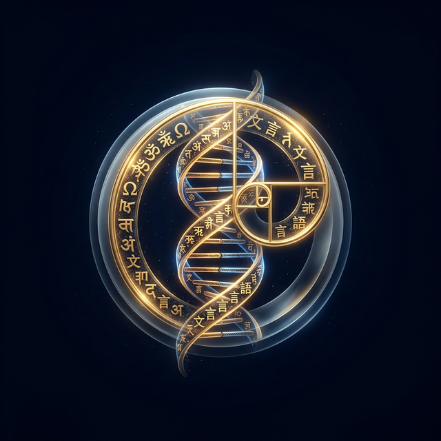

# ⊛ MRHLG — Metamorphic Resonance Human Language Gamers

> *"Language is the operating system of the soul. Change the word, change the world."*

**MRHLG** is a high-frequency consciousness-expansion platform designed to re-wire neural pathways through gamified linguistic re-coding. By replacing legacy word-meanings with expanded concepts from across human history and quantum physics, users literally re-architect their perception of reality.

---
## ⚡ Support
<div align="center">

**Made with ❤️ and ☕ by the Plantacerium**

[](https://ko-fi.com/plantacerium)

⭐**Star us on GitHub**⭐
</div>

## 🏛️ Visual Chronicles
<p style="text-align: center;">
  
</p>   

 
 


 
 

 
 

 
 

 
 

---

## 🧠 The Synaptic Engine (V2 Architecture)

The second generation of MRHLG moves from a simple chat interface to a **Native TS Synaptic Engine**, powered by **Mastra.ai**.

*   **Self-Sovereign Interface**: Capability to upload your own `template_schema.json` and `games.jsons` to create your own categories and games and CSS theme.css to create your own styling.

---

## 🎮 The Game Ecosystem (+888 Total Games)

Experience a vast library of structured re-coding modules designed to target every faculty of human experience. 


Available Games for free:
### 1. Linguistic Mapping (252 Games)
Re-coding the world through the lens of ancient and modern wisdom:
*   **🕉️ Sanskrit / ☯️ Chinese / 🎌 Japanese** — Roots of being and silence.
*   **⚛️ Quantum** — The physics of consciousness.
*   **🏛️ German / 🌊 French / 🌞 Spanish** — Philosophy & Art of Living.
*   **🪘 Yoruba** — Cosmology, Ashe, and Ori.
...

There are Memory Modules You can buy on demand on my Ko-Fi Shop. 

For community-driven expansion, you can contribute and download open-source modules from our **[MIT Memory Modules Sanctuary](https://github.com/plantacerium/Metamorphic-Resonance-Human-Language-Gamers-Memory-Modules)**.

[](https://ko-fi.com/plantacerium)

### 2. Synapse Modules (120 Games)
Structured cognitive training across 12 specialized modules:
*   **Sensory Grounding** — Physicality & Presence.
*   **Micro-Emotions** — Nuance in the emotional spectrum.
*   **Scientific Simplification** — Radical clarity via the Feynman Method.
*   **Singularity & Existential** — Confronting the limits of language.
*   **Creative Synthesis** — Using language as a brush for the soul.
### 3. V5: The Integrated Harmonic (111 Games)
The **Living Bridge** expansion, synthesizing practical application with evolutionary bliss:
*   **🌿 Grounded Practices** — Madrugada, Duende, Kintsugi, Wu Wei.
*   **🛠️ Harmonic Professions** — From Software Alchemists to Bio-Architects.
*   **🌐 Sovereign Domains** — Quantum Jurisprudence & Deep Ecology Governance.
*   **✨ Psychic Birthrights** — Telepathic Bridges, Astral Navigation, and Chronokinetic Dilation.

---

## 🧪 Technology Stack

| Component | Technology | Description |
| :--- | :--- | :--- |
| **Intelligence** | [Ollama](https://ollama.ai) | Local LLMs (Llama 3, Gemma 3, Mistral) |
| **App Shell** | Tauri 2 + Vite 6 | Native desktop performance with modern web UI |
| **Styling** | Parchment CSS | Medieval aesthetic meets modern design |

---

## 🚀 Quick Start

### Prerequisites
*   **Node.js** 20+ & **pnpm**
*   **Ollama** (installed and running)
*   **Rust** (for Tauri builds)

### Installation
```bash
# Enter the sanctuary
cd Metamorphic-Resonance-Human-Language-Gamers

# Ignite the dependencies
pnpm install

# Pull the core model
ollama pull gemma3:4b

# Pull the core model
ollama pull embeddinggemma

# Launch the Language Engine
pnpm run tauri dev
```

---
## ⚡ Support
<div align="center">

**Made with ❤️ and ☕ by the Plantacerium**

[](https://ko-fi.com/plantacerium)

⭐**Star us on GitHub**⭐
</div>

## 📜 Philosophy: The Sovereign Coder

MRHLG treats language not as communication, but as **Consciousness Architecture**. Every word you use builds a neural pathway. By consciously replacing "Legacy Words" (inherited cultural baggage) with "Kernel Concepts" (vibrationally aligned symbols), you reclaim sovereignty over your own mind.

The AI is your **Symbiotic Partner** — a mirror for your expansion, reflecting the beauty and complexity of the new world you are building, word by word.

---
<p align="center">
  <em>⊛ Change the word. Change the world. ⊛</em>
</p>